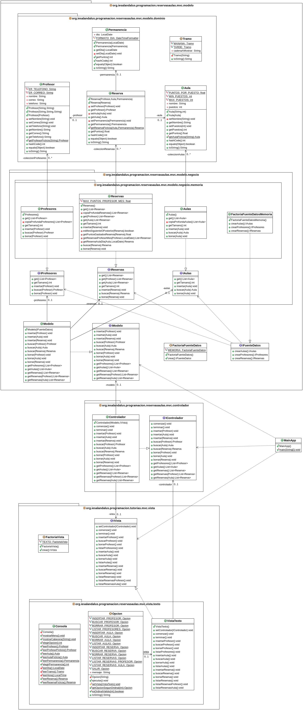

# Ejemplo Tarea: Reservas de Aulas
## Profesor: José Ramón Jiménez Reyes

Desde el IES Al-Ándalus nos comentan que necesitan que la persistencia se haga en una Base de Datos.

Por tanto, en este **sexto spring** abarcaremos tres nuevas fuentes de datos para nuestro modelo (además de la que ya teníamos).

- La fuente de datos que teníamos que accedía a ficheros locales.
- Una fuente de datos que accede a una Base de Datos MySQL de forma relacional.
- Una fuente de datos que accede a una Base de Datos MySQL de forma NoSQL utilizando el protocolo X (o  XdevAPI) de MySQL.
- Una fuente de datos que accede a una Base de Datos MongoDB.
- Se puede elegir la fuente de datos a utilizar mediante parámetros que se pasan a la aplicación:
    - `-fdficheros` Utiliza la fuente de datos de ficheros.
    - `-fdmysql` Utiliza la fuente de datos MySQL relacional.
    - `-fdmysqlxdevapi` Utiliza la fuente de datos MySQL accediendo mediante el protocolo X y de forma NoSQL.
    - `-fdmongodb` Utiliza la fuente de datos MongoDB. Esta es la opción por defecto. 
    
Las BD están alojadas todas en un servidor remoto de Google Cloud Platform creado para este menester.

Así quedaría el diagrama de clases de forma reducida:

Cuenta conmigo para cualquier duda que te pueda surgir o cualquier errata que puedas encontrar.

