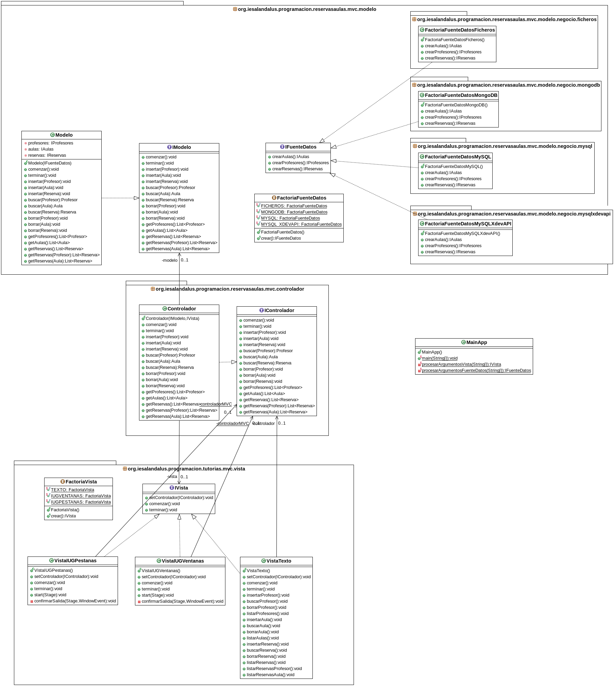

# Ejemplo Tarea: Reservas de Aulas
## Profesor: José Ramón Jiménez Reyes

Desde el IES Al-Ándalus nos comentan que necesitan gestionar la información desde una interfaz gráfica de usuario.

Por tanto, en este **quinto spring** abarcaremos la interfaz gráfica de usuario.

- He utilizado JavaFX para crear una interfaz gráfica que utiliza diferentes ventenas `IUGVentanas`.
- He utilizado JavaFX para crear otra interfaz gráfica que utiliza una ventana principal y hace uso de pestañas y tablas para gestionar la información `IUGPestanas`.
- Se puede elegir la interfaz a utilizar mediante parámetros que se pasan a la aplicación:
    - `-vventanas` Utiliza la interfaz gráfica de ventanas.
    - `-vpestanas` Utiliza la interfaz gráfica de pestañas y tablas. Ésta es la opción por defecto.
    - `-vtexto` Utiliza la interfaz textual que habíamos venido utilizando anteriormente. 

Así quedaría el diagrama de clases de forma reducida:

Cuenta conmigo para cualquier duda que te pueda surgir o cualquier errata que puedas encontrar.

